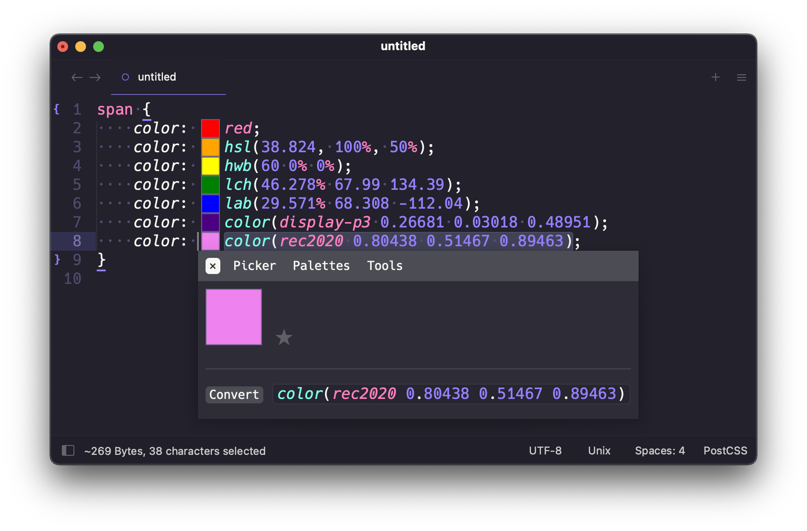
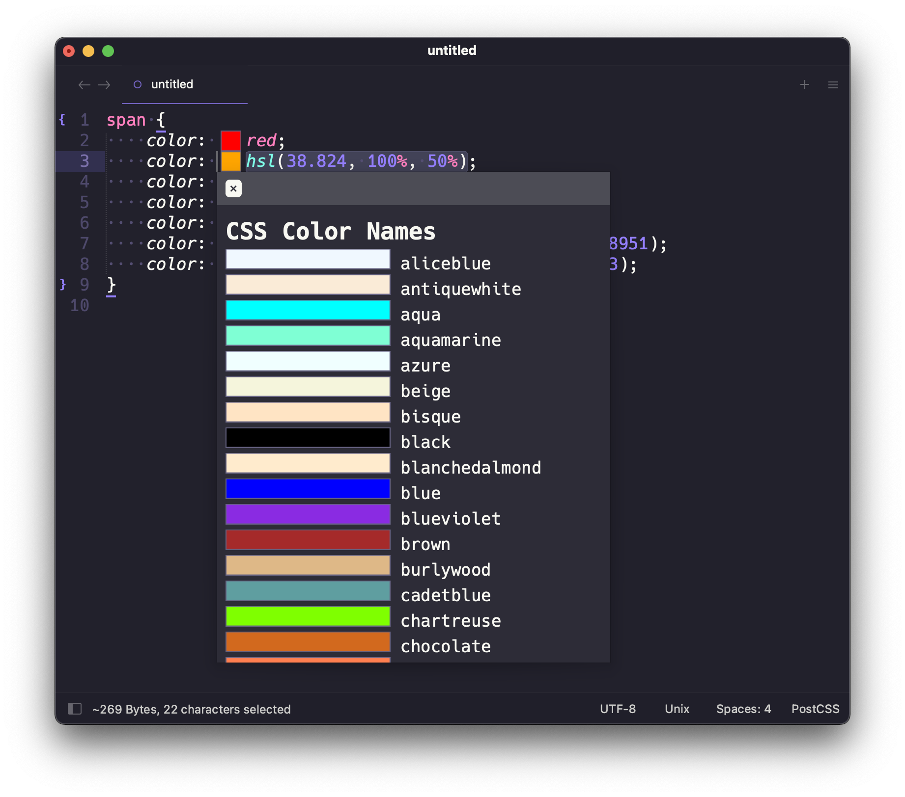
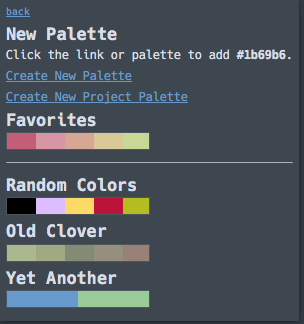
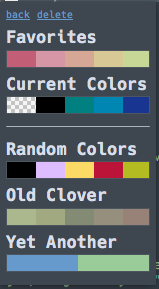
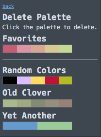
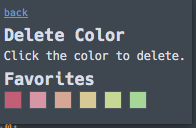

# User Guide

## Overview

ColorHelper is a CSS/SCSS/Sass tooltip.  When the cursor is on a CSS color, the tooltip will appear. When entering a color into a supported file, the color palette panel will be triggered so you can optionally insert a color from a saved palette.  The panel will popup after either: `#`, `rgb(`, `rgba(`, `hsl(` or `hsla(`.


!!! note "Note"
    Popups are provided by the [`mdpopups`][mdpopups] dependency.

## Color Info

The Color Info Panel will show a preview of the color, and other format variations of the color such as: color name, `hex`, `rgb`, `rgba`, `hsl`, and `hsla` format; if desired, you can convert the selected color to one of the shown formats by clicking the link to the left.



From the color info panel, you can launch a color picker, bookmark colors as a favorite, add/save the current color to a palette of your choice, or open the [Palette Panel](#palette-panel) to select a pre-saved color from an existing palette.

## Color Picker

The internal color picker can be launched from the view's context menu, the command palette, or from the [Color Info Panel](#color_info).  When launched it will use the color under the cursor (if available) as its starting color. The internal color picker is contained inside a tooltip.  It has a color map section at the top where different colors can be selected. It shows various valid CSS formats of the colors at the bottom.  And it shows either `rgba` channels or `hlsa` channels; a toggle is available to switch between them.


The color channels are coarse, but can generally allow you to get close to a color that you like.  As you select colors in the channel the selections will shift revealing more selections until the bounds of the color channel are reached.  If you need finer selections, you can click the label to the left and scrollable tooltip with much finer selections will appear so that you can select the best suited value.


If you would like to pick from a list of CSS color names, you can select the `CSS color names` link and a CSS Color Names panel will open:



If you would like to directly enter a different color, you can select the `enter new color` option.  An input panel will be open that can receive a color in the hex form of `#RRGGBBAA` where `RR` is the red channel, `GG` is the green channel, `BB` is the blue channel, and `AA` is the alpha channel.

To select a color, just click the `>>>` link to the right of the CSS format you want.

## Add Color Panel

The Add Color Panel presents the user with the option of either adding a color to an existing palette or creating a new global or project palette and adding the color to it.



When creating a new palette, the user will be presented with a input box to type the name of the palette to create.

## Palette Panel

The Palette panel will allow you to view the current saved palettes: favorites, saved user palette, and saved project palettes.



The Favorites palette and user palettes are found in your `Packages/User/ColorHelper.palettes`.  Project palettes are stored in your actual project file; if one does not exist, it will be stored in memory.

By clicking a palette, you will be taken to the [Color Panel](#color-panel) to select a color to insert into the current document.  You can also access the [Palette Delete Panel](#palette-delete-panel) directly.

## Palette Delete Panel

The Palette Delete Panel allows a user to delete an existing palette.  The only palettes that cannot be deleted is the Favorites palette and the Current Colors palette (if enabled).



To delete a palette, a user simply clicks a palette and it will be removed.

## Color Panel

The Color Panel allows you to click a color to insert it at your current color position.


You can also bring up the [Color Delete Panel](#color-delete-panel) from the view's context menu or the command palette.

## Color Delete Panel

The Color Delete Panel can delete any color from the given palette.  A user simply clicks the color to remove, and it will be removed.



## Settings

Settings for Color Helper are contained within the `color_helper.sublime-settings` file.

### `auto_popup`

Enable/disable auto popups.

```js
    // Show popups automatically in configured files.
    "auto_popup": true,
```

### `inline_previews`

Enable/disable inline color previews. `inline_previews` generates an image previews after the identified color in your source file.  You can click the preview to bring up the ColorHelper panel.


### `inline_preview_offset`

ColorHelper does it best to calculate the correct size for inline images, but with some font's or screen resolutions (or for a reason I don't quite understand) it will get it wrong and create an image larger (or maybe smaller) than your line height which may cause an undesirable look.  Set this value to either a positive or negative value which will be applied to the inline preview's image size.

```js
    // Adjust the size of inline image previews by the offset given.
    // Please use either a positive or negative number.
    "inline_preview_offset": 0,
```

If you need to set this per OS or per host, you can via [`multiconf`](#multiconf).

### `inline_preview_position`

Previews can be positioned to the left or right of a color. Set this value to "left" or "right to toggle its behavior.

```js
    // Adjust the position of inline image previews.
    // (left|right)
    "inline_preview_position": "left",
```

### `upper_case_hex`

When inserting a color from the tooltip, this setting will determine if hex colors get uppercased or lowercased.

```js
    // Upper case hex when inserting
    "upper_case_hex": false,
```

### `use_webcolor_names`

Will determine if a HTML color name will be shown for the currently selected colors. If inserting a web color name, transparency will be removed.

```js
    // Use webcolor names when value color matches a webcolor name.
    "use_webcolor_names": true,
```

### `click_color_box_to_pick`

This will make the color preview box in the [Color Info Panel](#color-info-panel) clickable.  When set to `color_picker` and clicked, it will open the color picker via the [ColorPicker](https://github.com/weslly/ColorPicker) plugin (if installed).  When set to `palette_picker` and clicked, it will open the [Palette Panel](#palette-panel). The respective menu item will not be shown in the [Color Info Panel](#color-info-panel) once relocated to the color preview.

```js
    // Color picker and palette picker by default
    // are accessed by clicking an icon on the color info panel.
    // Click access for one of thesecan be moved to the color box
    // (visual representation of the color).
    // (none|color_picker|palette_picker)
    "click_color_box_to_pick": "none",
```

### `graphic_size`

Coarse scaling of the size of generated graphics.  Graphics in the tooltips look best large as Sublime slightly distorts images, but on different screens, some of the tooltips (especially the internal color picker) may be too large or too small. `graphic_size` can be used to control the size of these generated images.  Scaling is based off line height, and valid settings are `small` (1X), `medium` (1.5X), and `large` (2X). `medium` is the default.

```js
    // If the color picker is too big or too small, try playing with this.
    // This is a coarse control which scales image size relative to the
    // approximate line height. small (1x), medium (1.5x), and large (2x).
    // (small | medium | large)
    "graphic_size": "medium",
```

If you need to set this per OS or per host, you can via [`multiconf`](#multiconf).

### `graphic_scale`

Fine scaling of the size of generated graphics. This overrides `graphic_size`.

```js
    // Fine scaling of image sizes. Overrides `graphic_size`.
    // Use an integer or floating point value. `null` disables fine scaling.
    "graphic_scale": 1.5,
````

### `enable_color_picker`

Enables the ability to launch the color picker from the tooltip.  By default, the internal color picker will be used.  If you have [@weslly](https://github.com/weslly)'s [ColorPicker](https://packagecontrol.io/packages/ColorPicker) package installed, you can use [use_color_picker_package](#use_color_picker_package) to use it instead of the internal color picker.

```js
    // Enable color picker option.  Will use native color picker
    // unless "use_color_picker_package" is enabled and external
    // package is installed.
    "enable_color_picker": true,
```

### `use_hex_color_picker`

Enables or disables the use of the hex color picker.  When enabled, the color picker has a hex shape as the colors fan out from the white center.  If disabled, the color picker will be a rectangular one that shows the colors by hue and by brightness.

```js
    // This can be turned off to get a rectangular color picker
    // That displays possible options by hue and brightness/luminance.
    "use_hex_color_picker": true,
```

Disabled look
: 
    

### `use_color_picker_package`

If you have [@weslly][weslly]'s [ColorPicker][color-picker] package installed, `user_color_picker_package` will cause it to override the default color picker, but only the default color picker supports transparency.

```js
    // Use https://github.com/weslly/ColorPicker for the color picker if installed.
    "use_color_picker_package": false,
```

### `enable_global_user_palettes`

Enables showing user palettes (found in `Packages/User/color_helper.palettes`) in the [Palette Panel](#palette-panel).

```js
    // Show global palettes in palette panel
    "enable_global_user_palettes": true,
```

### `enable_favorite_palette`

Enables showing the Favorites palette (found in `Packages/User/color_helper.palettes`) in the [Palette Panel](#palette-panel).

```js
    // Enable storing favorite colors to the favorite palette
    "enable_favorite_palette": true,
```

### `enable_current_file_palette`

Enables scanning of the current active view buffer for colors and showing them in the Current Colors palette in the [Palette Panel](#palette-panel).

```js
    // Enable showing current file color palette
    "enable_current_file_palette": true,
```

### `enable_project_user_palettes`

Enables showing and storing of user palettes in the project file.  Project palettes will be shown in the [Palette Panel](#palette-panel).

```js
    // Enable project palettes in palette panel (Palettes stored in project file).
    "enable_project_user_palettes": true
```

### `enable_color_conversions`

Enables showing the color conversion options on the [Color Info Panel](#color-info-panel).

```js
    // Enable color conversion options on color info panel
    "enable_color_conversions": true,
```

### `show_index_status`

Set whether indexing status is shown in the status bar.

```js
    // Show index status in the status bar.
    "show_index_status": true,
```

### `line_height_workaround`

Temporary workaround for Windows 10 HiDPI setups that reduces image sizes.

```js
    // For Windows 10 HiDPI setups.  This is a temporary workaround
    // to help reduce abnormally large color previews and other images.
    // This will be removed once the issue is fixed in Sublime Text 3.
    "line_height_workaround": false,
```

### `image_border_color`

For themes with popups that have a very different background than what is found as the default code background, it may be desirable to override image borders with a color that blends better. Border cannot be applied to images with CSS, so this option was exposed to allow user override.

Colors specified in the setting must be of the form `#RRGGBB`. `null` can be used to turn remove your override.

```js
    // Override image border color. This is mainly for schemes that use a dramatically different
    // background for popups vs code background. Color should be in the form `#RRGGBB`. Alpha channels will
    // be ignored.
    "image_border_color": "##ff0000"
```

### `color_scanning`

Setting to control color scanning which is responsible for both auto-popups and constructing "Current File Palette".

`color_scanning` is an array of rules.  Each rule can target file(s) and enable certain scanning certain scopes for specific colors.  Each rule is a dictionary.  `syntax_files`, `base_scopes`, and `extensions` or used to target the a file for scanning; you can use a specific one, or multiple.

```js
    "color_scanning": [
        {
            "syntax_files": [],
            "syntax_filter": "whitelist",
            "base_scopes": [
                "source.css",
                "text.html"
            ],
            "scan_scopes": [
                // CSS, CSS in HTML etc. (based on: Sublime Default)
                "meta.property-value.css -comment -string",
                // CSS3, CSS3 in HTML etc. (based on: https://packagecontrol.io/packages/CSS3)
                "meta.value.css -comment -string",
                // HTML attributes (based on: Sublime Default)
                "meta.tag.inline.any.html string.quoted",
                "meta.tag.any.html meta.attribute-with-value.style.html"
            ],
            "scan_completion_scopes": [],
            "extensions": [],
            "allowed_colors": ["css3"],
            "use_hex_argb": false,
            "compress_hex_output": true
        },
    ]
```

#### `color_scanning.syntax_files`

`syntax_files` is an array of syntax file (`tmLanguage` or `sublime-syntax`)names and are relative to `Packages` (extensions should be excluded).  They are used to filter views that will be targeted for scanning. Depending on how [`syntax_filter`](#color_scanningsyntax_filter) is set, `syntax_files` will either require the files to be in the list or not in the list.  If `syntax_files` is set as an empty array, all views will be targeted unless filtered further by other settings.

Assuming that you have a `tmLanguage` file `Packages/CSS/CSS.tmLanguage`:

```js
    "color_scanning": [
        {
            "syntax_files": ["CSS/CSS"],
```

#### `color_scanning.syntax_filter`

`syntax_filter` will cause [`syntax_files`](#color_scanningsyntax_files) to be treated as either a `blacklist` or `whitelist`.  Acceptable values are `"blacklist"` and `"whitelist"`.  `"whitelist"` is the default setting.

```js
    "color_scanning": [
        {
            "syntax_filter": "whitelist",
```

#### `color_scanning.base_scopes`

`base_scopes` is used to target specific file views that are syntax highlighted with a specific base scope.  This allows you to target multiple syntax highlighters that all use the same base scope.  `base_scopes` is an array; if the array is left empty, all views will be targeted unless filtered further by other settings.

```js
    "color_scanning": [
        {
            "base_scopes": ["source.css"],
```

#### `color_scanning.extensions`

`extensions` is used to target specific file views that a file name with the specified extension(s).  `extensions` is an array; if the array is left empty, all views will be targeted unless filtered further by other settings.  For this setting to work the file usually must exist on disk as views that do not exist on text usually do not have a file name.

```js
    "color_scanning": [
        {
            "extensions": [".css"],
```

#### `color_scanning.scan_scopes`

`scan_scopes` is an array of scopes that will be searched for colors.  Scopes in this array contain usually `tmTheme` scope syntax, so you can include scopes or exclude scopes etc.

In the example below, we target `meta.property-value.css`, but only if it is not also scoped as a `string` or a `comment`.

```js
    "color_scanning": [
        {
            "scan_scopes": ["meta.property-value.css -comment -string"]
```

#### `color_scanning.scan_completion_scopes`

`scan_completion_scopes` is an array of scopes that will be searched for certain syntax for color completions.  This is used only if `scan_scopes` is not sufficient to also capture colors that need to be completed.  For example: sometimes `scan_scopes` is not broad enough to capture incomplete colors, but we don't want to generally want to scan so broadly when scanning an entire file for complete colors.  Scopes in this array contain usually `tmTheme` scope syntax, so you can include scopes or exclude scopes etc.

In the example below, we target `source.scss` and `source.sass`, but only if they are not also scoped as `string` or `comment`.

```js
    "color_scanning": [
        {
            "scan_completion_scopes": [
                "source.scss -comment -string",
                "source.sass -comment -string"
            ],
```

#### `color_scanning.allowed_colors`

`allowed_colors` defines which colors will be scanned for in a specific file.  It is an array of strings where each strings specifies a color type or category of colors to scan for.

Value             | Description
----------------- | -----------
`webcolors`       | CSS3 color names plus CSS4's `rebeccapurple`.
`hex`             | Hex colors in the form of `#RRGGBB`.
`hex_compressed`  | Hex colors in the form of `#RGB`.
`hexa`            | Hex colors with an alpha channel in the form `#RRGGBBAA` or `#AARRGGBB` if `use_hex_argb` is set to `true`.
`hexa_compressed` | Hex colors with an alpha channel in the form `#RGBA` or `#ARGB` if `use_hex_argb` is set to `true`.
`rgb`             | `RGB` colors in the form `rgb(255, 128, 0)` or `rgb(100%, 50%, 0%)`.
`rgba`            | `RGBA` colors in the form `rgb(255, 128, 0, .5)` or `rgb(100%, 50%, 0%, .5)`. It also supports CSS4's alpha as a percentage format: `rgb(100%, 50%, 0%, 50%)`.
`hsl`             | `HSL` colors in the form `hsl(360, 100%, 50%)`.
`hsla`            | `HSLA` colors in the form `hsla(360, 100%, 50%, .5)`. It also supports CSS4's alpha as a percentage format: `hsla(360, 100%, 50%, 50%)`.
`gray`            | CSS4's gray format: `gray(255)` or `gray(100%)`.
`graya`           | CSS4's gray with alpha format: `gray(255, .5)` or `gray(100%, .5)`.  It also supports alpha as a percentage format: `gray(100%, 50%)`.
`hwb`             | CSS4's `HWB` color format: `hwb(360, 50%, 100%)`.
`hwba`            | CSS4's `HWBA` color format: `hwb(360, 50%, 100%, 5)` or `hwb(360, 50%, 100%, 50%)`.
`css3`            | All CSS3 formats: `webcolors`, `hex`, `hex_compressed`, `rgb`, `rgba`, `hsl`, `hsla`.
`css4`            | All CSS4 formats: `css3`, `gray`, `graya`, `hwb`, `hwba`, `hexa`, `hexa_compressed`.
`all`             | All color formats.

```js
    "color_scanning": [
        {
            "allowed_colors": ["css3"]
```

#### `color_scanning.use_hex_argb`

When scanning and processing hex `rgb` colors with alpha channels, process them as and output them with the alpha channel first opposed to at the end.  By default the value is `false`.

```js
    "color_scanning": [
        {
            "use_hex_argb": true
```

#### `color_scanning.compress_hex_output`

When outputting hex formats compress the color if possible `#334455` --> `#345`.  The default is `false`.

```js
    "color_scanning": [
        {
            "compress_hex_output": true
```

## Multiconf

Certain settings that lend them self better to be setting up per OS or per host will be configured to use `multiconf`.  `multiconf` is a library that will parse a setting as a normal setting or a per OS and/or per host setting (if configured properly).  For the settings that have this enabled, you can optionally use the format below to specify the setting per OS or per host.

The optional `multiconf` format requires a dictionary with a special identifier
`#multiconf#`  and a list of dictionaries identified by a qualifier of the form

```js
    "<qualifier name>:<qualifier value>[;<qualifier name>:<qualifier value>]..."
```

For example, the following setting

```js
    "user_home": "/home"
```

would result in `get("user_home")` returning the value "/home" but it could also
be replaced with

```js
    "user_home":  {
                    "#multiconf#": [
                        {"os:windows": "C:\\Users"},
                        {"os:linux;host:his_pc": "/home"},
                        {"os:linux;host:her_pc": "/home/her/special"}
                    ]
    }
```

Now the same configuration file will provide different values depending on the
machine it's on. On an MS Windows machine the value returned by `get` will be
"C:\\Users", and on a Linux machine with the host name `his_pc` the value will be
"/home", etc.

--8<-- "refs.md"
